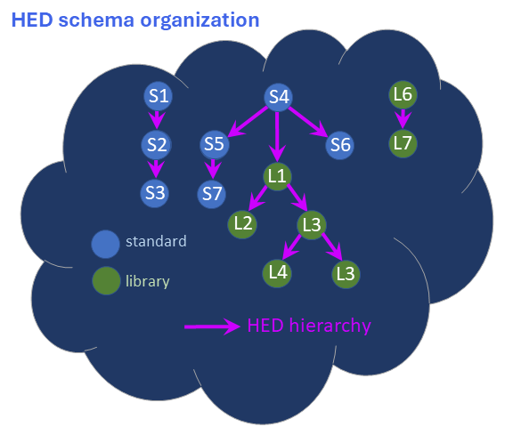
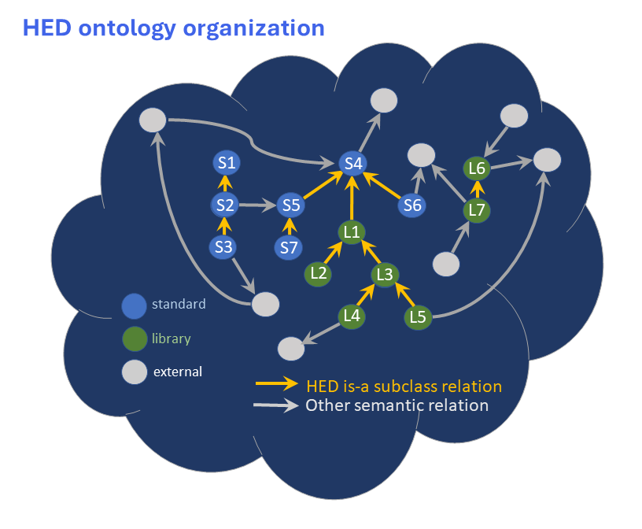
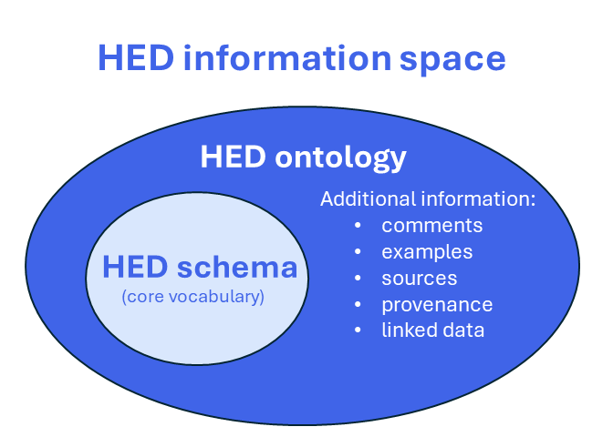
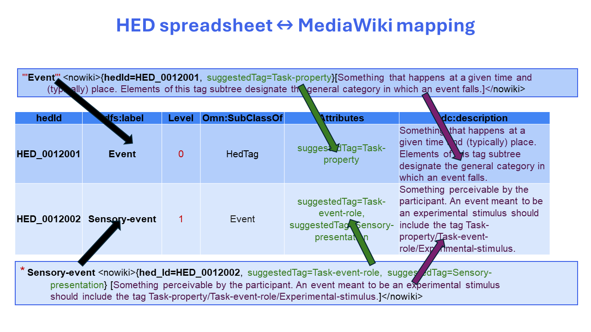
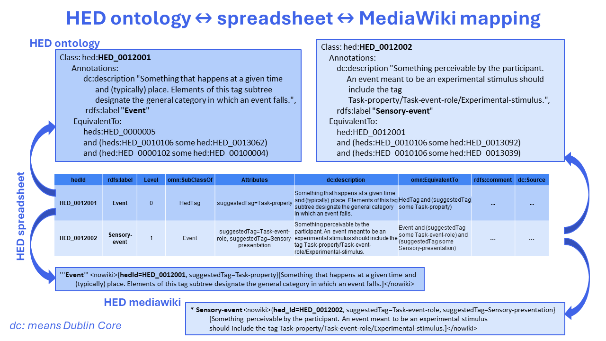

# 8. The HED ontology

This chapter defines the HED ontology and its relationship to the HED schema.
HED maps all of its entities (i.e., standard schema, library schemas, structural elements, properties)
into a single namespace with unique [**IRI**](https://datatracker.ietf.org/doc/html/rfc3987) (International Resource Identifier) identifiers
as explained in [**8.3 HED global identifiers**](#83-hed-global-identifiers).

The GitHub source repository for the HED ontologies is [**hed-ontology**](https://github.com/hed-standard/hed-ontology).
The GitHub source repository for the HED schemas is [**hed-schemas**](https://github.com/hed-standard/hed-schemas).

## 8.1. HED views and representations

### 8.1.1. The annotator's view

HED (Hierarchical Event Descriptors) has a standard hierarchically-organized vocabulary (the HED standard schema) 
and additional community-specific vocabularies (HED library schemas) that can be used to annotate and analyze experimental data.
The HED vocabularies and the supporting HED ecosystem are designed to support these activities.

The data annotator's natural view is top-down -- identifying a general category and
then filling out the details with more specific tags in that category or grouping with descriptive tags
from other categories. As illustrated in the following diagram, the HED schema hierarchy is organized in a top-down 
manner to support this work-flow.



In the diagram, top-level tags `S1`, `S4`, and `L6` represent general categories
and are roots of subtrees organized so that child nodes are more specific terms.
HED supports "search generality", so searches may specify an exact match or matches to any term in a particular subtree.
In the latter case, a search for `Event` may also match any of its descendents
(e.g., `Sensory-event` or `Agent-action`).

The [**HED schema viewer**](https://www.hedtags.org/display_hed.html),
allows users to focus on top-level categories or expand the hierarchy view to any specified level of detail.

### 8.1.2. The ontologist's view

A second view of HED --- the HED ontology --- provides a mapping between HED schemas and classical
ontologies in order to support semantic analysis and reasoning. 

The following diagram shows the ontology view of HED. 
The nodes of the HED schema are embedded in the HED ontology,
but the view is "term-centric" or "bottom-up" with links from the given term to its
parent class (yellow arrows) and as well links between the given term and other terms (gray arrows).



The ontology represents a complex network of interrelationships among the terms in the HED 
hierarchy and terms in other ontologies. 
The HED ontology and its mapping has been made explicit starting with HED standard schema 8.3.0.
The goal is to include links to additional information including provenance and examples during annotation 
and to leverage AI tools during annotation and analysis.

### 8.1.3. HED information space

The HED schema is embedded in a larger information space that includes
additional information such as sources, provenance, and links to other ontologies.
This HED information space is illustrated schematically in the following diagram.



The embedding is anchored by the `hedId` schema attribute introduced with HED standard schema 8.3.0.
The `hedId` values are of the form `HED_xxxxxxx` and resolve to IRIs (International Resource Identifiers) 
of the form *https://purl.org/hed/HED_xxxxxxx*.

The extended information space is completely represented by the HED ontology in OWL format.
In this document we use OWL Manchester format (`.omn`) for readability.  

### 8.1.4. HED representations

The HED vocabularies have 4 different formats as shown in the following table:

| Format      | Content | Uses | Editing |
|-------------| ------- | ---- | ------- |
| MediaWiki   | Schema | Schema development<br/>Schema updating | Manual editing<br/>Updated from spreadsheet |  
| XML         | Schema | Annotation tools<br/>Validation tools<br/>Analysis tools | Generated from MediaWiki |
| Spreadsheet | Complete | Schema development<br/>Schema updating<br/>Ontology updating | Manual editing<br/>Updated from MediaWiki<br/>Updated from OWL |
| OWL         | Complete | Ontology updating<br/>Semantic validation<br/>Documentation generation<br/>Semantic tools | Manual editing<br/>Updated from spreadsheet |

The HED schema, which contains the core HED vocabulary and captures the "annotator's view" of HED,
can be completely represented in the HED MediaWiki, XML, or spreadsheet formats.
The HED schema is used for annotation, validation, searching, and most analyses.
Tools access the HED schema in its XML format, but schema developers usually create
and update the schema in MediaWiki format, which is easier to read and displays as formatted
MarkDown on GitHub.
Alternatively schema developers may opt to create or update schemas from the HED spreadsheets.

#### 8.1.4.1. The MediaWiki format
The MediaWiki format is line-oriented with each non-blank line corresponding to a HED tag or other HED entity
such as a unit class or schema attribute definition.
See [**A.2. MediaWiki file format**](./Appendix_A.md#a2-mediawiki-file-format)
for a detailed description of the MediaWiki format.

#### 8.1.4.2. Spreadsheet files

The spreadsheet format consists of 10 tab-separated value (tsv) files each containing
the information for one type of HED entity as summarized in the following table.


| tsv file name          | Contents                                                                                                                 |
|------------------------|--------------------------------------------------------------------------------------------------------------------------|
| `xxx_AnnotationProperty` | These correspond to schema attributes that are not inherited.                                                            |
| `xxx_AttributeProperty`  | Definitions of the schema attribute properties corresponding<br/><br/>to the `Properties` section in the MediaWiki File. |
| `xxx_DataProperty`   | Schema attributes whose value is a literal such as boolean, string or numeric.                                           |
| `xxx_ObjectProperty`   | Schema attributes whose value is another schema entity such as a HED tag.                                                |
| `xxx_Structure`    | Structural entities including the header, prologue, and epilogue.                                                        |
| `xxx_Tag`   | Definitions of the HED tags (vocabulary) in the schema.                                                                  |
| `xxx_Unit`   | Definitions of the HED unit entities.                                                                                    |
| `xxx_UnitClass`   | Definitions of the HED unit classes.                                                                                     |
| `xxx_UnitModifier`   | Definitions of the HED unit modifiers.                                                                                   |
| `xxx_ValueClass`    | Definitions of the HED value classes.                                                                                    |

The `xxx_` prefix identifies the schema version.
For example, the prefix for standard schema version 8.3.0 is  `HED8.3.0_` and
the prefix for SCORE library schema 2.0.0 is `HED_score_2.0.0_`.

Most schema developers will only edit the `xxx_Tag.tsv` file or the `xxx_Structure.tsv` file.


#### 8.1.4.3. Spreadsheet format

Each HED spreadsheet must start with a 1-line header containing the column names of the file.
The first two column names are always `hedId` and `rdfs:label`.

| tsv file name          | Required column names                                                                                      |
|------------------------|------------------------------------------------------------------------------------------------------------|
| `xxx_AnnotationProperty` | `hedId`, `rdfs:label`, `Type`, `omn:Domain`, `omn:Range`, `dc:description`                                 |
| `xxx_AttributeProperty`  | `hedId`, `rdfs:label`, `Type`, `dc:description`                                                            |
| `xxx_DataProperty`   | `hedId`, `rdfs:label`, `Type`, `omn:Domain`, `omn:Range`, `Properties`, `dc:description`                   |
| `xxx_ObjectProperty`   | `hedId`, `rdfs:label`, `Type`, `omn:Domain`, `omn:Range`, `Properties`, `dc:description`                   |
| `xxx_Structure`    | `hedId`, `rdfs:label`, `Attributes`, `dc:description`                                                      |
| `xxx_Tag`   | `hedId`, `rdfs:label`, `Level`, `omn:SubClassOf`, `Attributes`, `dc:description`, `omn:EquivalentTo`       |
| `xxx_Unit`   | `hedId`, `rdfs:label`, `omn:SubClassOf`, `hadUnitClass`, `Attributes`, `dc:description`, `omn:EquivalentTo` |
| `xxx_UnitClass`   | `hedId`, `rdfs:label`, `omn:SubClassOf`, `Attributes`, `dc:description`, `omn:EquivalentTo`                                                                      |
| `xxx_UnitModifier`   | `hedId`, `rdfs:label`, `omn:SubClassOf`, `Attributes`, `dc:description`, `omn:EquivalentTo`                                                                    |
| `xxx_ValueClass`    | `hedId`, `rdfs:label`, `omn:SubClassOf`,  `Attributes`, `dc:description`, `omn:EquivalentTo`                                                                      |

The prefixes on column names have the following meanings:

| Column name prefix | Meaning                                                                                                            |
| ------------------ |--------------------------------------------------------------------------------------------------------------------|
|   `rdfs:`  | from [**RDF Schema**](https://en.wikipedia.org/wiki/RDF_Schema) (i.e., the Resource Description Framework Schema). |
| `dc:` | from [**DublinCore Ontology**](https://www.dublincore.org/resources/glossary/ontology/). |
|`omn:` | translated directly to OWL Manchester Format. |

Users may add additional columns corresponding to annotation properties from
the Dublin Core or the RDF schema (e.g., `dc:comment`) and the HED ontology framework will
include them in the ontology. However, these columns do not impact the HED schema.


#### 8.1.4.4. Spreadsheet <--> MediaWiki

Each non-blank line in a HED MediaWiki file corresponds to a single HED entity such as a HED tag.
Similarly, each row in a HED spreadsheet file corresponds to a single HED entity.
The fields of the HED MediaWiki format have a specific mapping to columns in a HED spreadsheet
as illustrated in the following example:



Note: The information about a single tag in the MediaWiki file must be on a single line,
but the above diagram has formatted the information so that it will fit within image boundaries.

The mapping of the spreadsheet row and column values to a line in the MediaWiki is further explained in the
following table:

| Spreadsheet<br/>column | Row value | MediaWiki format                                                                                                  |
| ----------- |:------------------:|-------------------------------------------------------------------------------------------------------------------|
| **hedId**  | *xxx* | {hedId=*xxx*, ... other attributes in comma separated list}                                                       |
| **rdfs:label**  | *yyy* | The tag's unique name is *yyy*.                                                                                   |
| **Level**  | 0 | This row corresponds to a top-level HED tag. **EX:**  `'''tag'''`.                                                |  
| **Level**  | *n* | For level *n* > 0, *n* asterisks appear in front of `tag`.<br/>Example: `* tag` when *n* = 1. **EX:** `** tag` when *n*=2. |
| **omn:SubClassOf** | *zzz* | The tag's parent tag in the HED hierarchy is *zzz*.                                                               |
| **Attributes** | *uuu*, *vvv*, ... | List appearing in curly braces: {hedId=*xxx*, *uuu*,  *vvv*, ...}         |
| **dc:description** | *www* | The contents of the square braces: [*www*].                                                                       |

Note: Attributes that have boolean values are true if the attribute is present and false if absent.
Non-boolean attributes are specified using "attribute-name=value".

HED schema developers can develop in either HED MediaWiki or HED spreadsheet (tab-separated-value) file format and
can use tools to update the representations.
Users may NOT assign or modify the `hedId`. When creating a new entity such as a tag, leave the `hedId` column blank.
If adding a new tag to the MediaWiki file, schema developers should omit the `hedId`. 
Tools will assign and validate the `hedId` during the update process.

#### 8.1.4.5. Tag spreadsheet <--> Ontology

HED spreadsheets have been expanded to include additional columns to capture all the information 
contained in the HED ontology as illustrated in the following example.
Notice that while the spreadsheet always refers to the entities by name (e.g., `rdfs:label`),
the ontology uses the `hedId`.



The HED ontology represents the entire HED information space in 
[**OWL**](https://www.w3.org/OWL/) (Web Ontology Language).
The HED ontology is available in both [**OWL/RDF**](https://www.w3.org/TR/owl2-mapping-to-rdf/) format
and [**OWL Manchester**](https://www.w3.org/TR/owl2-manchester-syntax/) format,
but the examples in this specification use OWL Manchester format for readability.
Developers must use the HED spreadsheets to create or update a HED ontology.

Most HED entities (i.e., tags, unit classes, units, unit modifiers, and value classes) map to 
classes in the HED ontology.
The HED schema attributes, which describe properties and behavior, are mapped to ontology properties
as described in [**8.2.3. Schema attributes**](#823-schema-attributes) section.
The HED schema properties, which describe the schema attributes, determine the type of property mapping
and are implicitly mapped.

The mapping of the spreadsheet row and column values to a class in the HED ontology is further explained in the
following table:


| Spreadsheet<br/>column | Row value | Ontology format |
| ----------- |:------------------:| ------- |
| **hedId**  | *xxx* | `Class: hed:xxx` |
| **rdfs:label**  | *yyy* | `rdfs:label yyy` in the `Annotations` section |
| **Level**  | *n* | Redundant information -- can be recovered using class hierarchy. |
| **omn:SubClassOf** | *zzz* | The tag is either a `SubClassOf` or `EquivalentTo` *zzz*<br/>but *zzz* is identified in the ontology<br/>by **hedId** rather name. |
| **Attributes** | *uuu*, *vvv*, ... | If non-empty, then these appear as restrictions<br/> in the `EquivalentTo`. See [**8.2.3. Schema attributes**|(./#823-schema-attributes). |
| **dc:description** | *www* | `dc:description www` in the `Annotations` section. |
|**omn:EquivalentTo** |    | A combination of the information in **omn:SubClassOf** and **Attributes**. |

The next section describes the ontology structure in more detail.


## 8.2. HED schema to ontology

Each element of a HED schema (i.e., tag, unit, unit class, unit modifier, value class, schema attribute, 
schema attribute property, schema header, epilogue, and prologue) is assigned a
unique persistent globally unique identifier (GUID).
This GUID appears as the entity identifier in the ontology and as the `hedId` attribute value in the HED schema.
In addition to the HED elements the HED ontology also has some overall structural elements
that are also assigned `hedId` values.

The examples in this section 
and `hed:` to represent schema-specific elements.
Both namespaces map to the same PURL (Persistent Uniform Resource Locator).

### 8.2.1. Overall ontology structure

HED requires that child tags of tags in the HED schema satisfy the **is-a** relationship.
This requirement is satisfied in HED ontology using subclass relationship.
The HED requirement of orthogonality between tags in different top-level subtrees 
can be captured in the HED ontology by imposing *disjointness* on the top-level trees,
but this is not currently being enforced.

The following table summarizes how the HED schema and HED ontology are mapped.

`````{list-table} HED ontology structure.
:widths: 15 75
:header-rows: 1

* - Schema
  - Ontology
* - **Header**
  - Class with `DataProperty` values for:
    * `version` - (required) semantic version of schema.
    * `library` - (optional) library name if library.
    * `withStandard` - (optional) semantic version of library's standard partner.
    * `merged`- (optional) library has been merged with its standard schema partner.
* - **Tag**
  - Class representing HED tags:
    * Defined in the `schema` section of the HED schema.
    * Uses subclassing to represent HED schema structure.
    * Top-level tags extend `HedTag` (`heds:HED_0000005`).
    * A rooted library tag extends its root in the standard schema.
    * The parent class appears either in `SubClassOf` or `EquivalentTo`.
* - **Unit class**
  - Defined in the `Unit classes` section of the HED schema.
    * Usually only defined in the standard schema.
    * Defining schema must define a class extending `HedUnitClass` (`heds:HED_0000006`).
    * Unit classes in the standard schema are subclasses of `StandardUnitClass` (`hed:HED_0010006`).
* - **Unit**
  - * Defined in the `Unit classes` section of HED schema under its unit class.
    * Usually only defined in the standard schema.
    * Defining schemas must define a class extending `HedUnit` (`heds:HED_0000007`).
    * Units in the standard schema are subclasses of `StandardUnit` (`hed:HED_0010007`).
    * The class must have the `hasUnitClass` (`heds:HED_0000103`) `ObjectProperty`.
* - **Unit modifier**
  - * Defined in the `Unit Modifiers` section of the HED schema.
    * Usually only defined in the standard schema
    * Defining schemas must define a class extending `HedUnitModifier` (`heds:HED_0000008`).
    * Unit modifiers in the standard schema inherit from `StandardUnitModifier` (`HED_0010008`).
* - **Value class** 
  - * Defined in the `Value classes` section of the HED schema.
    * Usually only defined in the standard schema.
    * Defining schemas must define a class extending `HedValueClass` (`heds:HED_0000009).
    * Value classes in the standard schema inherit from `StandardValueClass` (`hed:HED_0010009`).
* - **Schema attribute**
  - Maps as a property in the HED ontology:
    * `ObjectProperty` if `Range` is a class and it is inherited (no `AnnotationProperty`).
    * `DataProperty` if `Range` is a literal (boolean, numeric, or string) and it is inherited.
    * `AnnotationProperty` if not inherited.
* - **Schema property**
  - * Defined in the `Properties` section of the HED schema.
    * Property names ending in `Domain` specify classes the attribute can be applied to.
    * Property names ending in `Range` specify values the property can have.
    * The `AnnotationProperty` indicates that this schema attribute is not inherited.
    * Implicitly present in the HED ontology.

`````     

### 8.2.2. HED Tags

The HED schema hierarchy is captured by subclassing in the HED ontology.
Top-level tag nodes in the HED schema are direct subclasses of the `HedTag` class (`heds:HED_0000005`).
A descendant of a top-level tag node is a direct subclass of its parent tag node in the HED schema.
The ontology subclass relationship enforces the HED requirement that each tag in the
HED schema must satisfy the **is-a** relationship with its parent in the HED schema.

The examples of this section use the `Action` tag and its child `Communicate`
to illustrate how subclassing is represented in the various HED formats.

#### 8.2.2.1. MediaWiki tag format

The **MediaWiki** representation uses ordering and asterisks to mark parentage relationships.
In other words, the HED MediaWiki schema tree is given in depth-first search order.
The parent of a tag prefixed by *X* number of asterisks is a direct child of the first tag
above it with *X-1* asterisks.
Top level tags are enclosed by three quotes and have no parent within the schema (i.e., *X* = 0).

For the example, the `Action` tag is a top-level tag (enclosed in a set of three quotes).
The `Communicate` tag is a child (subclass) of `Action`.


````{admonition} **Example** HED MediaWiki representation of subclasses.

```text
'''Action''' <nowiki>{hedId=HED_0012016}[Do something.]</nowiki>
* Communicate <nowiki>{hedId=HED_0012017}[Action conveying knowledge of or about something.]</nowiki>
```

In this example `Action` is level 0 (top-level) and `Communicate` is level 1. 
MediaWiki uses ordering to determine subclasses. 
Since `Action` is the closest preceding tag whose level is one less than
that of `Communicate`, so `Action` is the parent tag of `Communicate`.

````
The tag's schema attributes are enclosed in curly braces, 
and the tag's description is enclosed in square brackets.

#### 8.2.2.2. XML tag format

The **XML** representation of a HED tag uses nesting to indicate hierarchical relationships in the HED schema. 
For HED tags (nodes) the nesting indicates subclassing.
For other schema elements such as unit classes and units,
nesting indicates organizational grouping rather than subclasses.

````{admonition} **Example** HED MediaWiki representation of subclasses.

```xml
<node>
   <name>Action</name>
   <description>Do something.</description>
   <attribute>
      <name>extensionAllowed</name>
   </attribute>
   <attribute>
      <name>hedId</name>
      <value>HED_0012016</value>
   </attribute>
   <node>
      <name>Communicate</name>
      <description>Action conveying knowledge of or information about something.</description>
      <attribute>
         <name>hedId</name>
         <value>HED_0012017</value>
      </attribute>  
   </node>
</node>
```
`Communicate` tag is a subclass (**is-a**) of `Action` because
its `<node></node>` definition is nested within the  `<node></node>` definition of `Action`.
````


#### 8.2.2.3. OWL format for HED classes

We use the [**OWL Manchester syntax**](https://www.w3.org/TR/owl2-manchester-syntax/)
for the examples in this specification document because of readability.
The HED ontology is also distributed in OWL/RDF format.

The following example illustrates the syntax for the HED mapping.
HED schema elements (tags, unit classes, unit modifiers, units, and value classes) are mapped to OWL classes. 
Every element has a unique `hedId`, which is represented as an OWL `AnnotationProperty`.
The `rdfs:label` annotation value is the name of the element as it appears in the HED schema.
The `dc:description` annotation value is the description of the element as it appears in square brackets
in the MediaWiki version of the schema.


````{admonition} **Example** HED Manchester OWL syntax.

```yaml
Class: hed:HED_0012016
    Annotations: 
        dc:description "Do something.,
        rdfs:label "Action"   
    EquivalentTo: 
        heds:HED_0000005
        and (heds:HED_0000102 some hed:HED_0010004)
        and (heds:HED_0010307 value "true")
    
Class: hed:HED_0012017
    Annotations: 
        dc:description "Action conveying knowledge of or information about something.",
        rdfs:label "Communicate"   
    SubClassOf: 
        hed:HED_0012016
```


The `Action` (`hed:HED_0012016`) class is a top level schema tag and 
therefore a subclass of `HedTag` (`heds:HED_0000005`).
The parentage relationship is represented by `EquivalentTo` rather than `SubClassOf`
because `Action` has the `extensionAllowed` (`hed:HED_0010307`) data property.
and the `inHedSchema` (`heds:HED_0000102`) object property.
Here `hed:HED_0010004` is the `HedStandardSchema` class, which has been declared elsewhere in the ontology.

The `Communicate` HED tag (`hed:HED_0012017`) is a direct child of `Action` as indicated by the `SubClassOf` entry.
Since `Communicate` is a subclass of `Action`, it inherits the `inHedSchema` association
with the correct version of the standard schema.
````

### 8.2.3. Schema attributes

The purpose of HED schema attributes is to specify characteristics and/or behavior of HED schema elements,
including tags, unit classes, units, unit modifiers, and value classes.
These attributes map schema elements into values or into other schema elements.


#### 8.2.3.1. Attribute ontology types

A given HED schema attribute's representation in the HED ontology is
determined by its domain, its range, and whether the attribute is inherited.
The mapping strategy is summarized in the following table.

| Ontology | Domain | Range | Inherited? |
| -------- | ------ | ----- | ----------- |
| `AnnotationProperty` | HED entity | string, numeric, boolean | No |  
| `DataProperty` | HED entity | string, numeric, boolean | Yes | 
| `ObjectProperty` | HED entity | HED element | Yes | 

`DataProperty` and `ObjectProperty` are inherited by subclasses, and reasoners can check their consistency.
`AnnotationProperty` is not inherited by subclasses, and reasoners ignore them.

#### 8.2.3.2. Schema attribute properties

Schema attribute properties appear in the `Properties` section of a HED schema.
Schema attribute properties determine how schema attributes behave and described in the following table.

| Attribute name |   Description |  
| -------------- | -------------- |
| `annotationProperty` | The value is not inherited by child nodes. |
| `boolRange` | The value can be true or false. This property was formerly named `boolProperty`. |
| `elementDomain` | The attribute can apply to any type of element (tag, unit, unit class, unit class, or value class). This property was formerly named `elementProperty`. |
| `tagDomain` | The attribute can apply to node (tag-term) elements. This property was formerly named `nodeProperty`. |
| `tagRange` | The value can be a node (tag). |
| `numericRange` | The value can be numeric. |
| `stringRange` | The value can be a string. |
| `unitClassDomain` | The attribute can apply to unit classes. This property was formerly named `unitClassProperty`. |
| `unitClassRange` | The value can be a unit class. |
| `unitModifierDomain` | The attribute can apply to unit modifiers. This property was formerly named `unitModifierProperty`. |
| `unitDomain` | The attribute can apply to units. This property was formerly named `unitProperty`. |
| `unitRange` | The value can be units. |
| `valueClassDomain` | The attribute can apply to value classes. This property was formerly named `valueClassProperty`. |
| `valueClassRange` | The value can be a value class. |

Each schema attribute property is translated to an `AnnotationProperty` in the ontology.

#### 8.2.3.3. Attribute representation

The following table lists schema attributes with their types (A=`AnnotationProperty`, D=`DataProperty`, 
and O=`ObjectProperty`), domains and ranges.

| Attribute | Type |  Domain  |  Range |  Handling
| --------- |------| ---------  | ---------- | ------|
| `allowedCharacter`  | D    | `unitDomain`<br/>`unitModifierDomain`<br/>`valueClassDomain` | string  |    |
| `conversionFactor` | D    | `unitDomain`<br/>`unitModifierDomain` | `numericRange` |    |
| `defaultUnits`  | O    | `unitClassDomain` | `unitRange` |    |
|  `deprecatedFrom` | D    | `elementDomain` | `stringRange`   |    |
| `extensionAllowed`  | D  | `tagDomain` | `boolRange` |   |
| `hedId` | A    | `elementDomain` | `stringRange` | Tools: Assign and verify. |
| `inLibrary` | D    | `elementDomain` | `stringRange` |    |
| `isPartOf` | O    | `tagDomain` | `tagRange` |  |
| `relatedTag` | O    | `tagDomain` | `tagRange` |    |
| `requireChild`  | A    | `tagDomain` | `boolRange` | Tools: Verify.  |
| `reserved`  | D    | `tagDomain` | `boolRange` |   |
| `rooted`  | A    | `tagDomain` | `tagRange` | Tools: make tag subclass of tag in range. |
| `SIUnit`  | D    | `unitDomain` | `boolRange` |   |
| `SIUnitModifier` | D    | `unitModifierDomain` | `boolRange` |   |   |
| `SIUnitSymbolModifier` | D    | `SIUnitSymbolModifier` |  `boolRange` |   | 
| `suggestedTag` | O    | `tagDomain` | `tagRange` |   |
| `tagGroup`  | D    | `tagDomain` | `boolRange` |   |
| `takesValue` | A    | `tagDomain` | `boolRange` | Only placeholders |
| `topLevelTagGroup` | D    | `tagDomain` | `boolRange`  |    | 
| `unique` | D    |`tagDomain`  | `boolRange`  |    |
| `unitClass` | O    | `tagDomain` | `unitRange`  |   |
| `unitPrefix` | D    | `unitDomain` | `boolRange`  |  |
| `unitSymbol` | D    |`unitDomain` |  `boolRange`  |   |
| `valueClass` | O    | `tagDomain` | `valueClassRange`  |   |


#### 8.2.3.4. MediaWiki attribute format

In the MediaWiki format, schema attributes appear in the `Schema Attributes` section of the schema.


````{admonition} **Example** HED MediaWiki representation of a schema attribute.

```text
* extensionAllowed <nowiki>{hedId=HED_0010307,tagDomain, boolRange}[Users can add unlimited levels of child nodes
                            under this tag. This tag is propagated to child nodes except for 
                            hashtag placeholders.]</nowiki>
```
Note: this example has line breaks added to fit on the page. Each element in MediaWiki must appear on one line.
````
The `extensionAllowed` attribute has a unique `hedId` value `HED_0010307`. The `tagDomain` attribute indicates that 
`extensionAllowed` is only a schema attribute of HED tags.
The `boolRange` attribute indicates that `extenstionAllowed` is true if present and false if absent.

#### 8.2.3.5. XML attribute format


Schema attribute definitions are nested in the `<schemaAttributeDefinitions>` section of the schema's XML file.
The format of an individual schema attribute is shown here.
````{admonition} **Example** HED XML representation of a schema attribute.

```xml
<schemaAttributeDefinition>
   <name>extensionAllowed</name>
   <description>Users can add unlimited levels of child nodes under this tag.
                This tag is propagated to child nodes except hashtag placeholders.
  </description>
  <property>
      <name>hedId</name>
      <value>HED_0010307</value>
   </property>
   <property>
       <name>tagDomain</name>
   </property>
   <property>
       <name>boolRange</name>
   </property>
</schemaAttributeDefinition>
```
````

#### 8.2.3.6. OWL format for attributes.

The Manchester Owl syntax for schema attributes is similar to that of classes above.
The following example shows the OWL definition for the HED `extensionAllowed dataProperty`:

````{admonition} **Example** HED Manchester OWL syntax for DataProperty extensionAllowed.

```text
DataProperty: hed:HED_0010307
    Annotations: 
        dc:description "A schema attribute indicating that users can add unlimited levels of child nodes under this tag. This tag is propagated to child nodes except for hashtag placeholders.",
        rdfs:label "extensionAllowed",
        hed:HED_0010704 true,
		hed:HED_0010702 true 
    Domain: 
        heds:HED_0000005  
    Range: 
        xsd:boolean

```
````

The HED `DataProperty` entities map an entity (Domain) into a value (Range) as
specified by the `Domain` and `Range` fields.
The `heds:HED_0000005` ID is the `HedTag` class.
In the HED schema, the domain and range of a schema attribute are 
conveyed by the schema properties,
which are also given as annotation properties.
The `hed:HED_0010704 true` annotation corresponds to the `tagDomain` schema property being true, 
while the `hed:HED_0010702 true` annotation corresponds to the `boolRange` schema property being true.

Similarly, the HED `ObjectProperty` entities map an entity (Domain) into another entity (Range)
specified by the `Domain` and `Range` fields as illustrated in the following example:

````{admonition} **Example** HED Manchester OWL syntax for rooted.
```text
bjectProperty: hed:HED_0010106
	Annotations:
		dc:description "A tag that is often associated with this tag. This attribute is used by tagging tools to provide tagging suggestions.",
		rdfs:label "suggestedTag",
		hed:HED_0010704 true,
		hed:HED_0010705 true
	Domain:
		hed:HED_0000005
	Range:
		hed:HED_0000005
```
````

The `heds:HED_0000005` ID is the `HedTag` class, indicating that `suggestedTag`
maps one HED tag into another. 
The `hed:HED_0010704 true` and `hed:HED_0010705 true` provide this information as annotations.


Unlike `DataProperty` and `ObjectProperty` attributes, `AnnotationProperty` attributes 
are not inherited and do not use domain and range specifications.
These must be handled individual by tools as flagged by the HED schema `annotationProperty` property.
In the OWL representation, information about the handling should be provided in an `rdfs:comment` field.


````{admonition} **Example** HED Manchester OWL syntax for rooted.

```text
AnnotationProperty: heds:HED_0010502
    Annotations: 
        dc:description "This top-level library schema node should have a parent which is the indicated node in the partnered standard schema.",
        rdfs:label "rooted",
        hed:HED_0010704 true,
		hed:HED_0010705 true
```
````    

### 8.2.4 Other auxiliary sections

The schema-ontology mapping for HED schema units, unit classes, unit modifiers, and value classes is
similar to that of HED tags. However, each of these auxiliary items should inherit from a 
superclass tied to the schema in which they are defined. 

For example the value classes that are defined in the standard schema should inherit from
`StandardValueClass` (`hed:HED_0010009`) not directly from `HedValueClass` (`heds:0000009`).

## 8.3. HED global identifiers

### 8.3.1. Schema identifiers

The HED tags in each HED schema are unique, 
so a HED tag is uniquely identified by its name (label) and schema version.
If the tag is from a library schema, the library name is part of the version. 
The rules for updating HED version numbers are specified in 
[**HED semantic versioning**](https://github.com/hed-standard/hed-schemas/blob/main/README.md#hed-semantic-versioning).

Starting with HED schema version 8.2.0 (released April 28, 2023),
HED library schemas are strongly recommended to be 
[**partnered with a standard schema**](./07_Library_schemas.md#73-partnered-schemas).
Partnered schemas are joined with a specific version of the standard schema
and are treated as a single integrated vocabulary for annotation and analysis.
Partnered schemas MUST not have name conflicts with their standard schema partner.

[**Lazy partnering**](./07_Library_schemas.md#736-lazy-partnering), 
introduced with HED schema version 8.3.0, allows any number of library schemas to be loaded
into a single integrated vocabulary provided they are partnered with the same version of the standard schema
and there are no name conflicts.
If there are conflicts, user-selected namespace prefixes must be used
in the version specification and in annotations to resolve the conflicts.
 

### 8.3.2. Ontology namespace

The HED ontology uses GUIDs (Global Universal Identifiers) of the form HED_xxxxxxx for all entities of HED 
schemas.

All HED standard and library schema entities are mapped to the `HED_xxxxxxx` namespace
using the range assignments described in the following table.

| HED ID |  Owl type | Description |
| ------ | --------- | ----------- |
| HED_0000001-<br/>HED_0000099 | `Class`  | HED schema structure (EX: `HedTag`). |
| HED_0000100-<br/>HED_0000299 | `ObjectProperty` | Common object function (EX: `hasUnitClass`).|
| HED_0000300-<br/>HED-0000499 | `DataProperty` | Common data function (EX: `library`). |
| HED_0000500-<br/>HED_0000999 | `AnnotationProperty` | Currently not used. |
| HED_0010001-<br/>HED_0010099 | `Class` | Standard schema structure (EX: `StandardHeader`). |
| HED_0010100-<br/>HED_0010299 | `ObjectProperty` | Standard schema object function (EX: `suggestedTag`).|
| HED_0010300-<br/>HED-0010499 | `DataProperty` | Standard schema data function (EX: `extensionAllowed`). |
| HED_0010500-<br/>HED-0010699 | `AnnotationProperty` | Standard schema property not inherited (EX: `takesValue`). |
| HED_0010700-<br/>HED-0010899 | `AnnotationProperty` | Standard schema attribute property (EX: `tagDomain`). |
| HED_0011300-<br/>HED_0011399 | `HedValueClass` | Standard schema value class (EX:`textClass`). |
| HED_0011400-<br/>HED_0011499 | `HedUnitModifier` | Standard schema unit modifier (EX: `deca`). |
| HED_0011500-<br/>HED_0011599 | `HedUnitClass` | Standard schema unit class (EX: `timeUnits`). |
| HED_0011600-<br/>HED_0011699 | `HedUnit` | Standard schema unit (EX: `hour`). |
| HED_0012000-<br/>HED_0039999  | `HedTag` | Standard schema HED tag (EX: `Sensory-event`). |
| HED_0042000-<br/>HED_0059999  | `HedTag` | SCORE schema HED tag (EX: `Episode`). |
| HED_0062000-<br/>HED_0079999  | `HedTag` | LANG schema HED tag. |

### 8.3.3. HED IRIs

HED IRIs [(**International Resource Identifiers**)](https://datatracker.ietf.org/doc/html/rfc3987) are mapped
to [**https://purl.org/hed**](https://purl.org/hed).
